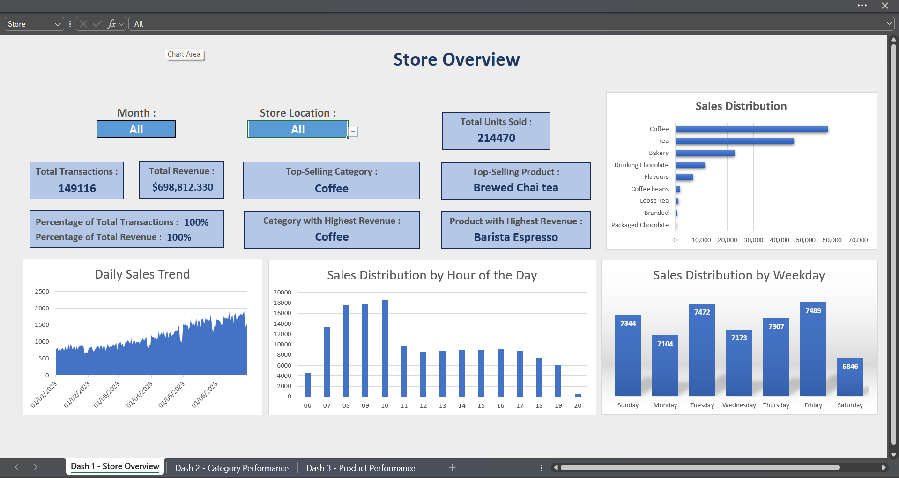
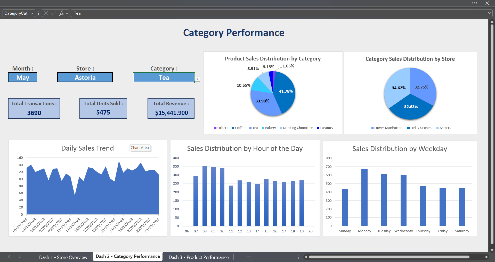
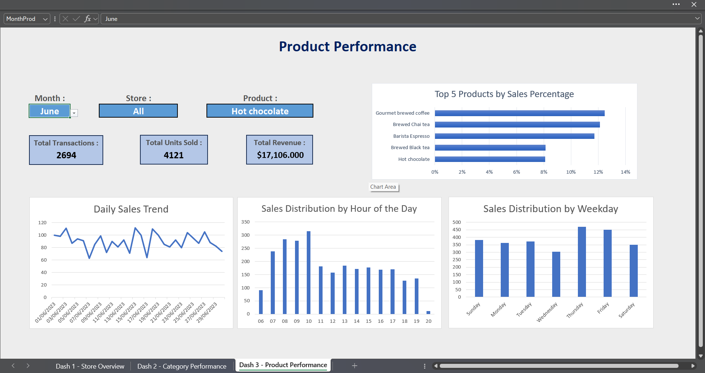

# ☕ Coffee Shop Sales Analysis Dashboard (Excel Project)

Welcome! This project is an interactive Excel dashboard built for analyzing the sales performance of a fictional coffee shop called **Maven Roasters**, based on real-style transaction data.

It’s designed to help business owners and analysts:
- Understand product performance
- Monitor store activity over time
- Identify peak hours and top-selling items
- Improve operational decisions using clean, visual insights

---

## 📂 Project Structure

| File/Folder | Description |
|-------------|-------------|
| `Coffee Shop Sales Dataset.xlsx` | The original dataset (transactions, products, and store info) |
| `Project File.xlsx` | The final project file including 3 dashboards |
| `Screenshots/` | Folder containing preview images of the dashboards |

---

## 📊 Dashboards Overview

This project includes **three interactive dashboards** created using Excel formulas and charts (no pivot tables used).

### 🏪 Store-Level Dashboard
- Sales KPIs by store and month
- Daily and hourly sales trends
- Product category breakdown
- Top-selling items and revenue contributors

### 📦 Category-Level Dashboard
- Performance of product categories across stores and time
- Distribution of transactions and product sales
- Key products driving revenue in each category

### 🧃 Product-Level Dashboard
- Individual product insights
- Sales evolution over days and hours
- Comparison across stores and time periods

> 🧠 *Each dashboard includes interactive filters for store, month, category, and product.*

---

## 💡 Key Excel Skills Demonstrated

- Data cleaning and transformation
- Advanced use of formulas: `TEXT()`, `COUNTIF()`, `SUMIFS()`, `IF()`, etc.
- Data validation for dynamic filtering
- Interactive charts (bar, line, pie) without Pivot Tables
- Dashboard design and layout principles

---

## 📷 Previews

### Store Dashboard

### Category Dashboard

### Product Dashboard

---

## 📁 Dataset Summary

This project uses a fictional but realistic dataset with:
- +149,000 transactions
- Product-level and store-level details
- Timestamps, quantities, unit prices, categories

---

## ✅ Why This Project?

This project was built to:
- Practice and apply real Excel data analysis techniques
- Create a reusable, business-ready template for small retailers
- Demonstrate core data skills to recruiters or freelance clients

---

## 📬 Contact

If you’d like a similar dashboard customized for your business or want to collaborate, feel free to reach out:

**Aimen Garbi**  
📧 aymengharbi983@gmail.com  
🌍 [LinkedIn Profile](https://www.linkedin.com/in/aimen-garbi-2485b8248/) 

---

## 📝 License

This project is shared for educational and professional portfolio purposes. Feel free to use the template or structure for your own learning.

